<p align="center">
  
</p>

<p align="center">
  <a href="#quickstart"></a>
  
  
  
</p>

<p align="center"><b>An assistant that builds its own abilities as you use it.<br>
The more you work with it, the better it gets at <i>your</i> work.</b></p>

---

## What this actually is

Most AI assistants come with a fixed set of abilities someone else chose. When
your real work needs something a little different, you're stuck waiting for a
plugin, an integration, or a new release.

This one starts with almost nothing on purpose. When it hits something it can't
do, **it writes the ability itself, right then, and keeps it.**

You talk to it in plain English. You never write code.

### Watch it happen

You ask something it has never been asked before:

```
> how did Q3 close out?
```

Instead of guessing, it builds what it needs:

```
  ✎ built a tool     parse_ledger            reads a ledger into monthly totals
  ▸ ran it           parse_ledger            q3.csv        →  jul 41,200 · aug…
  ✎ wrote a note     margin_review           when summarizing a quarter
  ✓ answered

Q3 closed at $132,160, up 14% on Q2. September carried it — roughly
half the quarter landed in the last five weeks.
```

Those lines are real output, printed live as it works. You watch it build the
thing, then use it.

Two things now exist that didn't sixty seconds ago:

- **A tool.** Real working code that reads your ledger. It runs safely, in its own
  sandbox, and it's there forever.
- **A note to itself.** How *you* like quarters summarized. Judgment, not code.

Ask next quarter and it just answers. That's the whole idea.

---

## The loop

<p align="center">
  
</p>

---

## Quickstart

Three commands and one paste. About a minute.

```bash
git clone https://github.com/joshuamschultz/simple-agent && cd simple-agent
./setup.sh
```

Open the `.env` file it created, paste in an API key, save. Then:

```bash
python3 agent.py
```

```
[cold start]
[anthropic · claude-sonnet-5]
> _
```

On later runs it tells you what it has become:

```
[loaded: 5 tools, 1 skill, team of 0, identity 4387 chars]
[anthropic · claude-sonnet-5]
```

That's it. **Two dependencies.** No accounts to create, no services to configure,
nothing running in the background. Everything stays on your machine.

<details>
<summary><b>Which API key do I need?</b></summary>

<br>

Any one of them. The default is Anthropic — get a key at
[console.anthropic.com](https://console.anthropic.com). Paste it into `.env` next
to `ANTHROPIC_API_KEY=`.

Prefer something else? `python3 agent.py --provider openai` and paste an OpenAI
key instead. Running a local model with Ollama needs no key at all.

You pay the model provider directly for what you use. Type `cost` at any time to
see what this session has spent.
</details>

<details>
<summary><b>Is my data going anywhere?</b></summary>

<br>

Only what you type goes to the model provider you chose, same as any chat
assistant. Everything the agent learns — its tools, its notes, your facts — is
stored in plain files in this folder. Nothing is uploaded anywhere else, and
there's no account or telemetry.

Passwords and API keys you give it are stored separately with locked-down file
permissions, handed to running code as environment variables, and scrubbed out of
anything it says back to you. It never sees the values itself.
</details>

---

## The three things it builds

Most assistants only have one of these. Having all three is what makes it
compound.

| | 🔧 **Tools** | 📘 **Notes to itself** | 🗂 **Facts** |
|---|---|---|---|
| **What it is** | Working code | Standing instructions | What's true in your world |
| **Good for** | Anything exact and repeatable | Judgment and taste | Names, numbers, decisions |
| **Example** | reads your ledger file | *"lead with the total, always give a lead time"* | *"Acme sells us steel — fast but pricey"* |

Say all three at once and it sorts them out itself:

```
> When I ask you to price a job, always confirm the quantity and the deadline
  first, and never quote without a lead time. I also need percent-change math.
  And remember our main supplier is Acme.

  ✎ wrote a note     pricing_procedure       ← taste
  ✎ built a tool     percent_change          ← exact math
  ▸ ran it           save_fact               supplier, Acme    ← something true
```

**It stays fast as it grows.** Only a one-line summary of each ability sits in
front of it. The details load only when it actually reaches for one — so fifty
abilities cost about as much as five.

---

## It asks before it builds the wrong thing

Half of what you ask has two honest readings. An assistant that guesses spends a
minute building the wrong one, and then you spend another minute explaining why.

So when the choice is genuinely yours, **it stops and asks** — right there in the
terminal, before it builds anything:

```
> I want to start tracking my invoices. Build what you need.

  ┌ Invoice fields ─────────────────────────────────────────────────────
  │ What do you need on each invoice? This decides the fields I build in.
  │
  │ ❯ Basics                  client, amount, issue date, due date, paid
  │   Basics + line items     each invoice lists several items or services
  │   Basics + currency       invoices in more than one currency
  │   Something else          say it in your own words
  └ ↑↓ move · 1-9 jump · enter choose · esc it decides
```

Arrow keys and enter, or just press the number. The menu disappears once you
answer and leaves one line behind, so your screen keeps the decision and not the
menu:

```
  ? asked            Basics                  Invoice fields
  ✎ built a tool     invoices                add, list, mark paid, summarize
  ✓ answered
```

**You are never boxed in.** *Something else* lets you type anything. `esc` hands
the decision back — it picks, tells you what it assumed, and carries on.

It's held to steering, not interviewing: **three questions per task, maximum**,
and only for choices that change what gets built. Not for permission, and not for
anything it could look up itself. If it asks something with one obvious answer,
that's a mistake, and its own review is told to go looking for it.

It never asks during its own self-review — nobody's watching that — and if it's
running unattended (piped input, or `--no-questions`), the lever isn't in its
hands at all: it decides, and says what it assumed.

---

## It corrects itself

Two ways, and neither one asks you to touch code.

### 1. Just tell it when it's wrong

```
> !fb you already have a supplier lookup — use it before saying you don't know
```

One sentence. It marks that answer as wrong, treats your words as the final say,
and has to go fix **whatever actually caused it** — the tool, the note, the saved
data, or its own instructions. Not apologize. Fix.

### 2. It re-reads its own work

Every few tasks it goes back over what you asked, what its tools returned, and
what it told you, with one question in mind: **did you get what you wanted?**
Something can technically work and still be wrong.

Here's a real thing it caught on its own:

> *"My supplier lookup and my customer lookup were both saving names to the same
> place, so 'Acme Corp' was showing up as both a supplier and a customer. I
> rewrote both to keep their records separate, made lookups forgiving about
> capitals so 'acme' finds 'Acme Corp', and wrote myself a note so this can't
> happen again."*

Nobody told it. It found that by reading its own history.

**It also checks itself, not just the conversation.** Reading the transcript only
finds problems you can see. So it goes and looks at the whole store directly and
asks a second set of questions: is anything saved somewhere no tool can reach any
more? Does each tool still describe where its data actually lives? Are two tools
keeping the same kind of thing in two places? Did something it replaced leave the
old records stranded?

That second pass matters because those failures are silent. A tool pointed at the
wrong place doesn't error — it politely returns nothing, and you get told you
don't have something you do.

<p align="center">
  
</p>

---

## It works past its own limits

Every assistant has a window — a fixed amount it can hold in front of it at once.
Three things run past that window, and each one has its own answer.

### 1. It does the work in code, not in its head

Ask about a thousand records and most assistants have to pull all thousand in
front of themselves just to count them. Worse, everything they read stays in the
way for the rest of the conversation.

This one writes a few lines of code, runs them, and keeps only the answer:

```
> how many of my open orders are past due, and what's the total?

  ⟩ ran code         rows = self.orders("l…  41 past due · $286,400
  ✓ answered
```

The thousand records never entered the conversation. One line did.

That code is scratch — it runs, it answers, it's gone. Nothing gets saved and
nothing piles up. When it notices it has written the same block twice, that's its
cue to turn it into a permanent tool instead.

### 2. It can read things too big to read

Ask it about something it saved months ago and a normal assistant is stuck: the
file is bigger than what it can hold at once.

This one splits the thing up and sends **a fresh reader at each part** — each one
a full sub-agent with a clean head, seeing only its own chunk and your question.
Then it combines what they found. Nothing huge ever lands in the conversation.

```
> check memory - who is jacob? he works with us
  ▸ ran it           manage_contacts         list          →  {'contacts': {}}
  ⌕ read all of      memory                  Who is Jacob? Any mention of a person…
  ✓ answered

Jacob is an **employee** (hire date 2026-08-08), assigned to the customer
**US Siding** (a steel siding installer in Alabama).
```

That first line is a tool looking in the one place it knows about, and finding
nothing. The second reads **everything you have**, in whatever shape it is
currently in, past every tool.

That difference matters more than it sounds. Tools each know one drawer. As the
agent reorganizes over months, things move — and a record can end up in a drawer
no tool opens any more. It's still there; nothing can see it. Reading everything
directly is how it finds those again, and it's the same move whether the thing
is your memory, a file, or everything it has ever built.

If what comes back is still too big to make sense of, it says so and asks you to
narrow the question. It does not quietly hand you half an answer.

**The two cover for each other.** Code answers what counting settles; reading
answers what takes judgment. When code prints more than it can look at, that
output isn't dumped on you — it's saved whole to a file and handed back as a
path, which is exactly what the readers take. Neither one dead-ends.

### 3. A long conversation gets folded, not dropped

Talk long enough and the earliest part of the conversation has to go. Throwing it
away is the quiet failure: it keeps answering with no idea that what it needed was
discarded twenty minutes ago, and you're the one who finds out.

So before letting go, it writes that stretch down — every fact you stated, every
decision, every correction, every number a tool came back with — and carries the
note forward:

```
  ⇲ compacted        18 messages             deadline moved to the 14th; Acme…
```

The note sits with its instructions, where the next trim can't reach it. It goes
away when you type `new` or restart, because by then the note *is* the
conversation.

---

## Where everything lives

Two things on disk hold the whole assistant. **`agent_state.json` is what it has
become. `agent_workspace/` is where it works.**

```
simple-agent/
├── agent.py            the whole assistant — one file, one class
├── llm.py              the only part that knows about model providers
├── prompts.py          its starting words, seeded into state on first run
├── test_agent.py       26 tests. No model, no network, no cost
├── setup.sh            the one-command install
├── .env                your API key. Never leaves this machine
│
├── agent_state.json    EVERYTHING IT HAS LEARNED
│                       its tools, its notes, its instructions, its specialists
│
└── agent_workspace/    EVERYTHING IT WORKS WITH
    ├── memory.data     every fact it has saved, in one shared file
    ├── traces.jsonl    every task it has ever done, appended forever
    ├── .secrets.json   your keys and passwords, locked to your user account
    ├── out_*.txt       output too long to read, parked for it to dig through
    └── team/
        └── sales/      one folder per specialist, made when it promotes one
            ├── memory.data     that specialist's own memory, kept between calls
            └── traces.jsonl    and its own history
```

All of it is plain files, right here in this folder. Nothing is running in the
background and nothing is stored anywhere else. Delete `agent_state.json` and it
goes back to knowing nothing; delete `agent_workspace/` and it forgets everything
it was ever told.

### Put your files in `agent_workspace/`

That folder is its desk. Anything you drop there it can pick up by name — no
upload, no path, no setting to change:

```bash
cp ~/Downloads/q3-sales.csv agent_workspace/
```
```
> what's in q3-sales.csv?
```

Files anywhere else on your machine work too, you just have to give the whole
path. Inside the workspace the name alone is enough, because that folder is where
its code actually runs.

It works in the other direction too. Ask for something written and, unless you
name somewhere else, that's where it lands:

```
> turn those into a summary I can send, and save it as q3-summary.md
```

**Watch the folder as you work.** It fills up while you use it: the files you gave
it, the files it wrote back, `memory.data` getting bigger every time it saves
something, a new folder under `team/` the first time it promotes a specialist.
Leave it open in Finder and you can watch what it's doing.

Two things in there are its own bookkeeping and you never need to open them:
`team/`, and `.secrets.json`, which holds your keys.

---

## It brings on specialists

Once one area of your work builds up enough abilities, it promotes them into a
**specialist** — a focused expert with its own instructions and its own memory.

Those abilities then move *out* of the main assistant's head. So the more it
learns, the more focused it stays.

<p align="center">
  
</p>

A new specialist gets **four things of its own**:

| | |
|---|---|
| **Its own instructions** | A starting prompt written for that corner of the work, not the general one. It rewrites its own prompt as it learns. |
| **Its own tools** | A named handful of what's been built so far, handed over to it. |
| **Its own notes** | The skills that go with those tools, handed over too. |
| **Its own memory file** | A folder on disk it keeps updating, call after call. This is the part that tunes over months. |

The tools and notes it takes are **pared off the main assistant** — it stops
carrying them, which is the whole point. There's still only one shared store
underneath, so nothing gets duplicated or drifts out of sync. And anything the
specialist builds while working goes straight back into that shared store, under
its name.

**How one actually gets better.** Every call, three things carry forward:

- **Its memory grows.** Its own file on disk, added to on every call, never reset.
- **Its instructions sharpen.** It can rewrite its own prompt, and the new version
  is what starts the next call.
- **Its abilities compound.** Anything it builds joins the shared store *and* its
  own list, so it's better equipped next time.

Specialists don't run in the background or cost anything when idle. They're just
there when a matching task comes up, remembering everything they've learned about
that corner of your work.

One honest limit: a specialist doesn't re-read its own work the way the main
assistant does. The main one reviews itself on a cadence; a specialist only
improves through what it saves, writes and builds. If one starts drifting, you'll
correct it the same way you correct anything else — by saying so.

---

## What people point it at

Same assistant, different jobs. Every line is paste-ready.

**Email**
```
> draft my replies: decision first, short, no filler. save that as how you
  always write email for me
```

**Morning briefing**
```
> each morning, give me one screen: what's open, what's late, what I said
  I'd do. most urgent first
```

**Meeting notes**
```
> here are my notes. pull the decisions, who owns each one, and the dates.
  keep a running list I can ask about later
```

**Customer and vendor notes**
```
> remember what I tell you about each customer and supplier, and show me
  the history next time I mention one
```

**Planning**
```
> turn this project into weeks with dependencies, and tell me what slips
  if one task moves
```

**Sales planning and coaching**
```
> track my pipeline by stage and value. every monday, tell me which deals
  went quiet and what to say to each one
```

**SEO and AEO**
```
> read this page and tell me two things: what it's missing to rank, and
  what it's missing to get quoted in an AI answer
```

**Bookkeeping and admin**
```
> categorize these expenses the way I did last month, and flag anything
  that doesn't match a pattern you've seen
```

Nothing above is a feature that shipped with it. It builds each one the first
time you ask, and keeps it.

---

## Things to try on day one

Every line here is something you can type as-is.

**Give it a memory**
```
> keep track of the people and companies I mention, and let me look them
  up later even if I only remember part of the name
```

**Point it at your files** (copy them into `agent_workspace/` first)
```
> look at the spreadsheets in your workspace and tell me what's in them
> now let me ask questions about any of them
```

**Make it work it out instead of reading it**
```
> count how many of these are still open, and total them by month
```

**Teach it your taste**
```
> when you write anything for me, lead with the answer, then the detail.
  no preamble, no summary at the end.
```

**Let it reach the web** (start with `python3 agent.py --allow-network`)
```
> !secret GITHUB_TOKEN
> show me my open pull requests and summarize what changed in each
```

**Let it tidy up**
```
> those note-taking abilities have piled up — turn them into a specialist
```

The pattern never changes. **Say what you want. Let it build. Correct it once.**

---

## Watching it work

It narrates itself while it works, so you can see it building and using its own
machinery instead of guessing.

| Line | What just happened |
|---|---|
| `✎ built a tool` | it wrote working code and kept it |
| `✎ wrote a note` | it wrote a standing instruction to itself |
| `▸ ran it` | it used something it built — the tool, what it was called with, what came back |
| `⟩ ran code` | it worked something out in code rather than reading it all. The block it ran, and the answer it kept |
| `⌕ read all of` | it read something too long to read, in parts, past every tool |
| `⇲ compacted` | the conversation outgrew its window, so the oldest part was folded into a note it keeps |
| `? asked` | it put a choice to you and waited — what you picked, and what it was about |
| `↳ read a note` | it loaded one of its notes *before* doing the work |
| `↳ read a tool` | it read a tool's own description back, usually before repairing it |
| `⟲ rewrote itself` | it changed its own instructions |
| `⚑ new specialist` | it promoted a group of abilities into an expert |
| `→ handed off to` | a specialist took the task — its own lines indent underneath |
| `✗ failed` | a call didn't work. It sees this too, and has to deal with it |
| `┌── reviewing its own work` | the periodic self-review. Everything until `└── done reviewing` is a **separate task** it gave itself — your answer has already printed above it |

Names are colour-coded by kind, and a kind keeps its colour everywhere it
appears — so you can spot what it's touching without reading the verb.

| | |
|---|---|
| 🔵 cyan | a **tool** |
| 🟢 green | a **note** to itself |
| 🟣 magenta | a **prompt**, including its own identity |
| 🟡 yellow | a **specialist** |
| 🔴 red | something failed |

Start with `python3 agent.py --quiet` if you'd rather just see answers, or
`--no-questions` if you'd rather it never stopped to ask you anything. Colour
turns itself off when the output isn't a terminal, or if you set `NO_COLOR=1`.

---

## While you're at the prompt

Everything below is typed at the `>` prompt. Nothing here costs a model call
except `review`.

**See what it has become**

| Type this | What you get |
|---|---|
| `tools` | every tool it has built, and which specialist owns each |
| `skills` | every note to itself, when it uses each, how often it has read it |
| `skill <name>` | one of those notes, in full |
| `team` | its specialists and what each is for |
| `identity` | its current instructions, exactly as the model sees them |
| `raw` | everything it has remembered, straight from the store |
| `history` | this session the way it reviews it — calls, results, answers |
| `cost` | what you have spent since you started |

**Change it**

| Type this | What happens |
|---|---|
| `!fb <text>` | tell it it was wrong. **This is the important one** — it treats your words as final and has to go fix whatever caused it |
| `review` | make it re-read its own work now instead of waiting for the cadence |
| `!secret NAME` | store a password or key. You type the value privately; it never sees the value, only the name |
| `!secrets` | list which secrets are stored, names only |

**Session**

| Type this | What happens |
|---|---|
| `new` (or `clear`) | start a fresh conversation, keep everything it has learned |
| `exit` (or `quit`) | save and leave |

---

<details>
<summary><h2 style="display:inline">For the technically curious</h2></summary>

<br>

**Three files, three jobs — and one that proves them.**

```
agent.py       the harness — knows nothing about any model provider
llm.py         the seam — one method, plain dicts. Swap it for litellm, raw HTTP, anything
prompts.py     the words — seeded into state on first run, then the agent owns them
test_agent.py  26 tests. Every one stubs the model or needs none: python3 test_agent.py
```

**One JSON file is the whole agent.** `agent_state.json` — tools, notes,
prompts, identity, specialists, recent history. No database, no migration.

```jsonc
{
  "manifest": { "manage_contacts": { "code": "def manage_contacts(self, action: str, ...", "description": "..." } },
  "skills":   { "pricing_procedure": { "when": "when asked to price a job", "body": "...", "uses": 3 } },
  "prompts":  { "identity": "...", "draft": "...", "review": "...", "compact": "...", "carried": "..." },
  "team":     { "sales": { "identity": "...", "tools": [...], "skills": [...], "description": "..." } },
  "traces":   [ ... ]
}
```

**Everything is a string — including the code.** A grown tool is not a module
and not a plugin. It is the *text* of a Python function, sitting in JSON, and it
gets turned back into a callable on demand:

- Every turn, `_tools_schema()` `exec`s each stored code string, reads the
  resulting function with `inspect.signature`, and builds the tool schema from
  that. Nothing is imported. Nothing is precompiled.
- Every turn, `_build_system()` rebuilds the system prompt from
  `prompts["identity"]`, plus a one-line index of every skill, plus the team
  roster.
- To actually run a tool, `_run_sandboxed()` joins every code string together,
  drops the lot into a runner template, and `exec`s it in a subprocess where
  each function is bound onto a shim object. That binding is why grown code can
  call `self._raw_read()` and `self._secret("NAME")`.

So there's no build step and no registration. The model writes a string; on the
next turn the string is a tool.

**You can edit the same file it edits.** Quit, open `agent_state.json`, change
anything — reword its identity, fix a line inside a grown tool, delete a skill,
retune the `draft` prompt that writes every future tool — then start it again.
It reloads straight from that JSON and your change is live on the next message.
It saves after every task, so edit between runs rather than during one. Delete
the file to go back to stock; new keys added to `prompts.py` flow into an
existing state on its next load.

**Grown code runs in a subprocess** with a timeout, a scrubbed environment, and
the workspace as its working directory — which is why a relative filename in
grown code, or in a block of `run_python`, resolves inside `agent_workspace/`.
Secrets are passed in as `SECRET_<NAME>` env vars and scrubbed back out of
anything the process returns.

> That stops *accidents* — hangs, crashes, a tool wandering somewhere it
> shouldn't. It does not stop malice: same user, same filesystem. Container-wrap
> the runner before real stakes.

**What it can change about itself**

| Lever | What it does |
|---|---|
| `grow_tool` / `read_tool` / `forget_tool` | write a tool, read one back to repair it, or drop one that shouldn't exist |
| `grow_skill` / `read_skill` / `forget_skill` | write, load, or drop a standing instruction |
| `run_python` | run a block in the same sandbox with every grown tool in scope. Nothing kept, only what it prints comes back |
| `survey` | read something of any length — memory, a file, everything it has built — past every tool |
| `update_identity` | rewrite its own system prompt |
| `read_prompt` / `update_prompt` | rewrite how it drafts tools, reviews itself, or compacts a conversation |
| `create_specialist` / `call_specialist` / `dissolve_specialist` | manage its team |
| `spawn_agent` | one-off sub-agent, then gone |

**The activity lines are a hook, not a `print`.** Set `agent.on_event = fn` and
you get a dict per tool call — `{phase, tool, args, result, ok, meta, depth,
fresh}` — twice per call (`start`, then `end`), plus once per turn when an
answer lands. Specialists and sub-agents inherit the same callback and report
their own `depth`, which is what makes their work indent. `_reporter()` in
`agent.py` is just one consumer; swap in a logger, a UI, a metrics sink.
Exceptions inside an observer are swallowed on purpose — a broken display must
never cost you a task.

**One way a child agent is born.** A specialist, a one-off sub-agent, and a
`survey` reader are the same machinery: `_child()` builds it with the shared
connection pool, the one harness-owned secrets vault, the same narration
callback, and one more level of depth. Only three things ever differ — who it
is, where it works, and which subset of the registry it can see.

`_absorb()` then takes back everything it produced. Not just what it spent —
what it **built**. A tool a reader had to write to finish its part is as real as
one the root wrote, and throwing it away only means the next child writes it
again. A child never clobbers a tool the root already has; it does hand back
skills, which is how a specialist sharpens shared judgment.

**Computing past the context window.** `run_python(code)` is not growth and
registers nothing. It hands the block to the *same* `_sandbox` a grown tool goes
through, with every stored tool defined and bound to `self` first — so a block
reads exactly like a tool body: `self.<tool>(...)`, `self._raw_read()`,
`self._secret(...)`, any import, `open()`. One process per run, nothing carried
between them.

Only stdout comes back. That's the whole economy: a tool call parks its entire
result in the conversation for the rest of the session, where a block can read a
hundred thousand records and hand back one number. Forty tool calls become one
turn and one line.

Print more than `CODE_OUTPUT_CHARS` (4,000) and the output does *not* land in the
window. `_clip()` writes all of it to `agent_workspace/out_<id>.txt` and returns
the head plus that path — the handoff to the other reading path below. Nothing is
ever truncated silently.

**Reading past the context window.** `survey(question, source)` resolves the
source — `"memory"` for the raw store, `"state"` for everything grown, or a file
path — splits it, and runs one reader agent per part. Each reader sees only its
part and the question. Their findings come back and are merged in one more pass.

If those findings are themselves larger than one window, it returns `FAILED` and
asks for a narrower question. It does *not* fold them again: folding drops
records silently, and a quiet wrong answer is worse than a loud refusal.

The chunk is 400,000 characters — about 100k tokens. On a million-token model
that means splitting is the rare case, which is the point. One reader that sees
everything beats five that each see a slice.

**Compacting the conversation.** `_trim_conversation()` holds the thread to
`CONTEXT_MESSAGES` (60) and never simply deletes what falls off the front.
Whole exchanges leave together — cutting mid-exchange orphans a tool call — and
what leaves goes through `_compact()`: one model call using the `compact` prompt,
folding the dropped stretch *and* the previous note into one new note. That note
rides in the system prompt under the `carried` prompt, where the next trim can't
reach it.

It must never cost a turn. Those messages are already out of the window by the
time `_compact` runs, so a failed compaction leaves a visible hole in the note
(`[N earlier messages … could not be summarized]`) instead of raising. Saying the
hole is there beats pretending nothing was lost.

The note dies on restart and on `new`, along with the conversation it summarizes.
Tools, skills, facts and identity are not in it and do not care.

**How memory actually gets made**

Three kinds of memory, made three different ways.

*A fact* — "our main supplier is Acme"

1. The model looks for a tool that owns that kind of record. If there isn't one,
   it calls `grow_tool` first, then saves.
2. It calls that tool. The tool runs in a subprocess.
3. Inside, `self._raw_read()` hands back the **entire** store as one JSON
   string. The tool parses it, puts its record under its own top-level key, and
   writes the whole document back with `self._raw_write(json.dumps(data))`.
4. That write is atomic — temp file, then rename. A crash leaves the previous
   contents intact.

One file, `agent_workspace/memory.data`, shared by every tool it has ever
written. Read the whole thing, change only your own key, write the whole thing
back. That rule lives in the `draft` prompt, so every tool it writes is told it.

*A note to itself* — "always confirm quantity and deadline"

`grow_skill(name, when_to_use, body)` writes straight into `state["skills"]`.
Only `name` and `when_to_use` ride in the system prompt; `read_skill` pulls the
body in on the turn it's needed. That's why a large library stays cheap.

*A tool*

`grow_tool(description)` makes a **second** model call using the `draft` prompt.
That call returns JSON — `{name, description, code}`. The harness `compile()`s
the code to check it parses and confirms `def <name>(` is really in there. That
is the whole check: valid, not correct. Then it lands in `state["manifest"]` and
is callable on the next step. Growing under an existing name *replaces* it,
which is how it repairs its own tools instead of piling up near-duplicates.

*History*

Every task appends one line to `agent_workspace/traces.jsonl` — what you asked,
each tool call with its result, what it answered. The most recent 200 also ride
in the state file. The review reads that transcript back and asks one question
of it.

*What deliberately doesn't persist:* the conversation. Restart and the thread is
clean. The tools, skills, facts and identity are not.

**What a specialist actually is**

`create_specialist(name, identity, tools, description, skills)` writes one entry
into `state["team"]` — a seed prompt, a list of tool names, a list of skill
names, a one-line roster description — and makes the folder
`agent_workspace/team/<name>/`. That's the whole registration. Nothing is
copied, nothing runs.

`call_specialist(name, task)` then assembles it on the spot:

- a fresh `SelfBuildingAgent` pointed at that folder, so it gets its **own**
  `memory.data` and its own `traces.jsonl`
- `child.manifest` = only the named tools; `child.skills` = only the named
  skills — subsets of the one central registry, not copies of it
- `child.identity` = the seed prompt from its team entry
- the root's connection pool and the single harness-owned secrets vault, shared

It runs one task, then `_absorb` puts everything it grew into the central
registry, and its roster entry is updated to what the child ended up with —
including its own prompt if it rewrote one. Next call starts from the sharper
version.

Two things follow from the subsets. `_tools_schema()` and `_build_system()` skip
anything a specialist owns, which is how the root's context *shrinks* as the
team grows. And a specialist runs on a reduced lever set (`_META_CHILD`): it can
grow tools, grow skills and rewrite its own identity, but it cannot create
further specialists or touch the `draft` and `review` prompts.

Its conversation starts empty on every call. Continuity comes from its memory
file and its prompt — which is exactly why both are its own.

`dissolve_specialist` drops the roster entry. The tools and skills return to the
root's context; the folder and its memory stay on disk.

**Configuration**

| Flag | Default | Effect |
|---|---|---|
| `--provider` | `anthropic` | any provider `llm.py` supports |
| `--model` | provider default | e.g. `claude-opus-4-6` |
| `--workspace` | `agent_workspace` | its desk: the files you give it, memory, secrets, specialist dirs, trace log |
| `--state` | `agent_state.json` | everything it has learned |
| `--allow-network` | off | grown code may make network calls |
| `--allow-spawn` | off | enables one-off sub-agents |
| `--quiet` | off | hide the live activity lines |
| `--no-questions` | off | never stop to ask you anything — it decides and says what it assumed |

Tuning constants sit at the top of `agent.py`: tool rounds per task, how many
messages stay in the window, how much printed output may enter it, how often it
reviews itself, how far back it looks.

**Running for months.** Full history appends to `agent_workspace/traces.jsonl`;
only the recent tail rides in the state file, so it stays roughly fixed size.
What grows is the library of abilities, and specialists keep that out of the
prompt.

</details>

---

## Being straight with you

An assistant that rewrites itself deserves an honest README.

- **A new ability is only as good as its first draft.** The agent checks that the
  code is valid, not that it's correct. Wrong code gets caught when you correct it
  or when it reviews itself — one task later, not zero.
- **It will occasionally say it saved something it didn't.** Type `history` when
  something feels off. That log is how you catch it.
- **Giving it a file is a copy, not an upload.** There's no drop zone and no
  folder that watches itself. Move the file into `agent_workspace/`, then say its
  name. That's the whole flow today, and it's the part most likely to get nicer.
- **A very long conversation is a summary of itself.** Past about sixty messages
  the oldest part is a note, not the words. It keeps facts, decisions and
  corrections on purpose, but a detail it judged unimportant is gone. Anything
  that must survive belongs in a saved fact, not in the thread.
- **It can rewrite its own instructions badly.** Self-review is the safeguard, not
  a guarantee.
- **This is one agent on one machine.** No accounts, no sync, no multi-user. That
  simplicity is the point.
- **Prompts are seeded once.** After first run they belong to the agent, in
  `agent_state.json`. Upgrading the project adds any *new* prompt but will not
  replace one it already has — delete that key from state if you want the new
  version. `setup.sh` says so when it spots an existing state file.

---

<p align="center"><sub>MIT. Take it apart.</sub></p>
