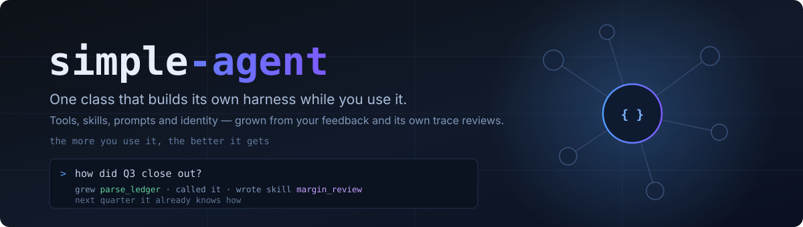
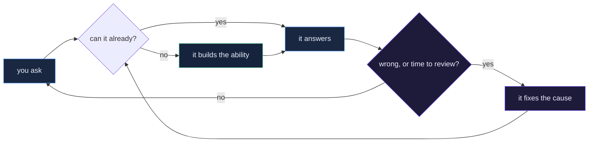
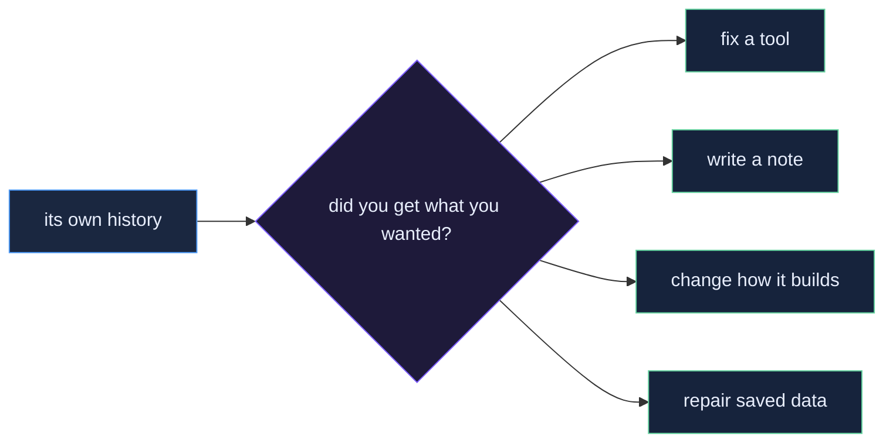
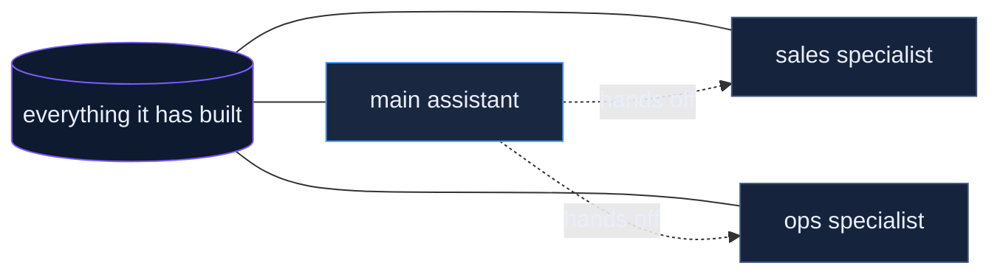

<p align="center">
  
</p>

<p align="center">
  <a href="#quickstart"></a>
  
  
  
</p>

<p align="center"><b>An assistant that builds its own abilities as you use it.<br>
The more you work with it, the better it gets at <i>your</i> work.</b></p>

---

## What this actually is

Most AI assistants come with a fixed set of abilities someone else chose. When
your real work needs something a little different, you're stuck waiting for a
plugin, an integration, or a new release.

This one starts with almost nothing on purpose. When it hits something it can't
do, **it writes the ability itself, right then, and keeps it.**

You talk to it in plain English. You never write code.

### Watch it happen

You ask something it has never been asked before:

```
> how did Q3 close out?
```

Instead of guessing, it builds what it needs:

```
  ✎ built a tool     parse_ledger      reads a ledger file into monthly totals
  ▸ ran it           ledger_q3.csv  →  jul 41,200 · aug 38,650 · sep 52,310
  ✎ wrote a note     margin_review     how you like quarters summarized
  ✓ answered

Q3 closed at $132,160, up 14% on Q2. September carried it — roughly
half the quarter landed in the last five weeks.
```

Two things now exist that didn't sixty seconds ago:

- **A tool.** Real working code that reads your ledger. It runs safely, in its own
  sandbox, and it's there forever.
- **A note to itself.** How *you* like quarters summarized. Judgment, not code.

Ask next quarter and it just answers. That's the whole idea.

---

## The loop



---

## Quickstart

Three commands and one paste. About a minute.

```bash
git clone https://github.com/joshuamschultz/simple-agent && cd simple-agent
./setup.sh
```

Open the `.env` file it created, paste in an API key, save. Then:

```bash
python3 agent.py
```

```
[cold start]
[anthropic · claude-sonnet-5]
> _
```

That's it. **Two dependencies.** No accounts to create, no services to configure,
nothing running in the background. Everything stays on your machine.

<details>
<summary><b>Which API key do I need?</b></summary>

<br>

Any one of them. The default is Anthropic — get a key at
[console.anthropic.com](https://console.anthropic.com). Paste it into `.env` next
to `ANTHROPIC_API_KEY=`.

Prefer something else? `python3 agent.py --provider openai` and paste an OpenAI
key instead. Running a local model with Ollama needs no key at all.

You pay the model provider directly for what you use. Type `cost` at any time to
see what this session has spent.
</details>

<details>
<summary><b>Is my data going anywhere?</b></summary>

<br>

Only what you type goes to the model provider you chose, same as any chat
assistant. Everything the agent learns — its tools, its notes, your facts — is
stored in plain files in this folder. Nothing is uploaded anywhere else, and
there's no account or telemetry.

Passwords and API keys you give it are stored separately with locked-down file
permissions, handed to running code as environment variables, and scrubbed out of
anything it says back to you. It never sees the values itself.
</details>

---

## The three things it builds

Most assistants only have one of these. Having all three is what makes it
compound.

| | 🔧 **Tools** | 📘 **Notes to itself** | 🗂 **Facts** |
|---|---|---|---|
| **What it is** | Working code | Standing instructions | What's true in your world |
| **Good for** | Anything exact and repeatable | Judgment and taste | Names, numbers, decisions |
| **Example** | reads your ledger file | *"lead with the total, always give a lead time"* | *"Acme sells us steel — fast but pricey"* |

Say all three at once and it sorts them out itself:

```
> When I ask you to price a job, always confirm the quantity and the deadline
  first, and never quote without a lead time. I also need percent-change math.
  And remember our main supplier is Acme.

  ✎ note to itself   pricing_procedure     ← taste
  ✎ built a tool     percent_change        ← exact math
  ▸ saved a fact     supplier = Acme       ← something true
```

**It stays fast as it grows.** Only a one-line summary of each ability sits in
front of it. The details load only when it actually reaches for one — so fifty
abilities cost about as much as five.

---

## It corrects itself

Two ways, and neither one asks you to touch code.

### 1. Just tell it when it's wrong

```
> !fb you already have a supplier lookup — use it before saying you don't know
```

One sentence. It marks that answer as wrong, treats your words as the final say,
and has to go fix **whatever actually caused it** — the tool, the note, the saved
data, or its own instructions. Not apologize. Fix.

### 2. It re-reads its own work

Every few tasks it goes back over what you asked, what its tools returned, and
what it told you, with one question in mind: **did you get what you wanted?**
Something can technically work and still be wrong.

Here's a real thing it caught on its own:

> *"My supplier lookup and my customer lookup were both saving names to the same
> place, so 'Acme Corp' was showing up as both a supplier and a customer. I
> rewrote both to keep their records separate, made lookups forgiving about
> capitals so 'acme' finds 'Acme Corp', and wrote myself a note so this can't
> happen again."*

Nobody told it. It found that by reading its own history.



---

## It brings on specialists

Once one area of your work builds up enough abilities, it promotes them into a
**specialist** — a focused expert with its own instructions and its own memory.

Those abilities then move *out* of the main assistant's head. So the more it
learns, the more focused it stays.



Specialists don't run in the background or cost anything when idle. They're just
there when a matching task comes up, remembering everything they've learned about
that corner of your work.

---

## Things to try on day one

Every line here is something you can type as-is.

**Give it a memory**
```
> keep track of the people and companies I mention, and let me look them
  up later even if I only remember part of the name
```

**Point it at your files**
```
> look at the spreadsheets in this folder and tell me what's in them
> now let me ask questions about any of them
```

**Teach it your taste**
```
> when I paste meeting notes, pull out the decisions and who owns each one.
  decisions first, no filler.
```

**Let it reach the web** (start with `python3 agent.py --allow-network`)
```
> !secret GITHUB_TOKEN
> show me my open pull requests and summarize what changed in each
```

**Let it tidy up**
```
> those note-taking abilities have piled up — turn them into a specialist
```

Other directions people take it: sorting the inbox, categorizing expenses,
tracking a sales pipeline, watching a home server, keeping a reading pile,
studying for something and remembering what you keep getting wrong.

The pattern never changes. **Say what you want. Let it build. Correct it once.**

---

## While you're at the prompt

| Type this | To see |
|---|---|
| `tools` / `skills` | what it has built so far |
| `skill <name>` | one of its notes, in full |
| `team` | its specialists |
| `identity` | its current instructions |
| `history` | this session, the way it reviews it |
| `review` | make it review itself right now |
| `raw` | everything it has remembered |
| `cost` | what you've spent this session |
| `!fb <text>` | correct it — this is the important one |
| `!secret NAME` | store a password or key, typed privately |
| `new` | start a fresh conversation, keep everything it learned |

---

<details>
<summary><h2 style="display:inline">For the technically curious</h2></summary>

<br>

**Three files, three jobs.**

```
agent.py     the harness — knows nothing about any model provider
llm.py       the seam — one method, plain dicts. Swap it for litellm, raw HTTP, anything
prompts.py   the words — seeded into state on first run, then the agent owns them
```

**Everything learned lives in `agent_state.json`** — tools, notes, prompts,
identity, specialists, recent history. Delete it to start over. Edit it by hand
to retune the agent. There is no database and no migration.

**Grown code runs in a subprocess** with a timeout and a scrubbed environment.

> That stops *accidents* — hangs, crashes, a tool wandering somewhere it
> shouldn't. It does not stop malice: same user, same filesystem. Container-wrap
> the runner before real stakes.

**What it can change about itself**

| Lever | What it does |
|---|---|
| `grow_tool` / `read_tool` | write a new tool, or read one back to repair it |
| `grow_skill` / `read_skill` / `forget_skill` | write, load, or drop a standing instruction |
| `update_identity` | rewrite its own system prompt |
| `read_prompt` / `update_prompt` | rewrite how it drafts tools, or how it reviews itself |
| `create_specialist` / `call_specialist` / `dissolve_specialist` | manage its team |
| `spawn_agent` | one-off sub-agent, then gone |

**Configuration**

| Flag | Default | Effect |
|---|---|---|
| `--provider` | `anthropic` | any provider `llm.py` supports |
| `--model` | provider default | e.g. `claude-opus-4-6` |
| `--workspace` | `agent_workspace` | memory, secrets, specialist dirs, trace log |
| `--state` | `agent_state.json` | everything it has learned |
| `--allow-network` | off | grown code may make network calls |
| `--allow-spawn` | off | enables one-off sub-agents |

Tuning constants sit at the top of `agent.py`: tool rounds per task, how often it
reviews itself, how far back it looks.

**Running for months.** Full history appends to `agent_workspace/traces.jsonl`;
only the recent tail rides in the state file, so it stays roughly fixed size.
What grows is the library of abilities, and specialists keep that out of the
prompt.

</details>

---

## Being straight with you

An assistant that rewrites itself deserves an honest README.

- **A new ability is only as good as its first draft.** The agent checks that the
  code is valid, not that it's correct. Wrong code gets caught when you correct it
  or when it reviews itself — one task later, not zero.
- **It will occasionally say it saved something it didn't.** Type `history` when
  something feels off. That log is how you catch it.
- **It can rewrite its own instructions badly.** Self-review is the safeguard, not
  a guarantee.
- **This is one agent on one machine.** No accounts, no sync, no multi-user. That
  simplicity is the point.

---

<p align="center"><sub>MIT. Take it apart.</sub></p>
